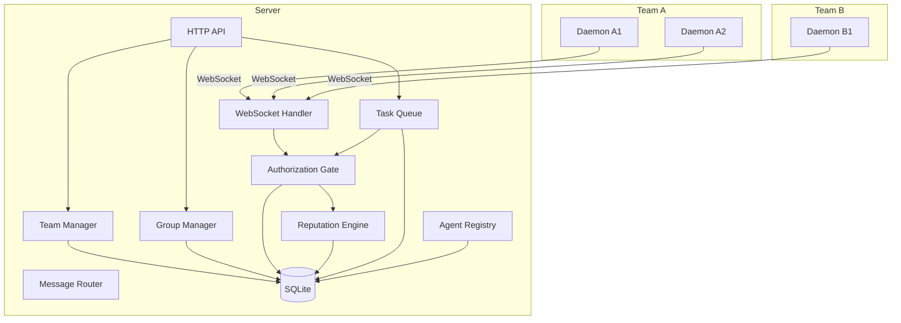

# System Architecture: Agent Chat Box — 群级扩展

**Date:** 2026-05-11
**Architect:** fjibj
**Version:** 1.0
**Project Type:** web-app
**Project Level:** 3
**Status:** Draft

---

## Document Overview

本文档定义 agent-chat-box 群级扩展的系统架构。在现有「中央调度 + Worker 反向连接」架构上，叠加团队 (Team) 和群 (Group) 层，实现跨团队任务协作。

**Related Documents:**
- PRD: `docs/prd-agent-chat-box-group-expansion-2026-05-11.md`
- Product Brief: `docs/product-brief-agent-chat-box-group-expansion-2026-05-11.md`
- Expansion Plan: `docs/多Agents协作扩展方案.txt`

---

## Executive Summary

在现有模块化单体架构 (Modular Monolith) 上扩展，不引入微服务。新增团队抽象层、群契约模块、两级任务池、授权闸门、信誉分系统。所有新功能作为新模块加入现有 Server，数据库通过迁移脚本扩展。WebSocket 协议向后兼容扩展。现有单团队用户行为完全不变。

---

## Architectural Drivers

这些需求对架构有重大影响：

1. **NFR-002: 跨团队隔离** → 外部 Agent 不能访问发布者内部数据。需要在 API 层和数据层实现 team_id 隔离。
2. **NFR-005: 向后兼容** → 现有 API 和 WebSocket 协议不变。新功能通过扩展实现，不修改现有行为。
3. **NFR-001: 群任务广播延迟 < 5s** → WebSocket 广播需高效，避免遍历所有连接。
4. **NFR-004: 任务不丢失** → 任何环节失败都能回退。需要状态机严格管理。
5. **NFR-006: 群规模 50+ 团队** → 数据库查询需索引优化，避免 N+1 查询。

---

## System Overview

### High-Level Architecture

现有架构：中央 Server（Fastify HTTP + WebSocket）+ Worker Daemon（反向连接）+ SQLite 数据库。

扩展后架构：在 Server 内新增 4 个模块层，不改变整体部署拓扑。

```
┌─────────────────────────────────────────────────────────────┐
│                     Central Server                           │
│                                                              │
│  ┌──────────┐ ┌──────────┐ ┌──────────┐ ┌────────┐         │
│  │ TaskQueue │ │ AgentReg │ │ MsgRouter│ │ WebUI  │  ← 现有  │
│  └──────────┘ └──────────┘ └──────────┘ └────────┘         │
│                                                              │
│  ┌──────────┐ ┌──────────┐ ┌──────────┐ ┌────────────┐     │
│  │ TeamMgr  │ │ GroupMgr │ │ AuthGate │ │ Reputation │  ← 新增│
│  └──────────┘ └──────────┘ └──────────┘ └────────────┘     │
│                                                              │
│         WebSocket / HTTP API (向后兼容扩展)                    │
└──────────┬──────────────┬──────────────┬─────────────────────┘
           │              │              │
    ┌──────┴──────┐ ┌─────┴──────┐ ┌────┴───────┐
    │ Agent Worker│ │ Agent Worker│ │ Agent Worker│
    │ (Team A)    │ │ (Team B)    │ │ (Team C)   │
    └─────────────┘ └────────────┘ └────────────┘
```

### Architecture Diagram



### Architectural Pattern

**Pattern:** Modular Monolith — 在现有单体 Server 内新增独立模块

**Rationale:**
- 现有项目是单体架构，用户规模小（< 100 团队），不需要微服务
- SQLite 单文件数据库，不适合分布式
- 独立开发者维护，微服务增加运维复杂度
- 新模块通过清晰接口与现有模块交互，保持松耦合

---

## Technology Stack

### Frontend

**Choice:** React + TypeScript + Tailwind CSS + shadcn/ui（保持不变）

**Rationale:** 现有技术栈，无需更改。新增群管理页面和跨团队任务看板。

**Trade-offs:** 无变化。

### Backend

**Choice:** Fastify + WebSocket (ws) + TypeScript（保持不变）

**Rationale:** 现有框架，性能好，类型安全。新增模块作为 Fastify 插件注册。

**Trade-offs:** 无变化。

### Database

**Choice:** SQLite (sql.js)（保持不变）

**Rationale:** 单文件部署，零运维。通过迁移脚本扩展表结构。

**Trade-offs:** 不支持并发写入（WAL 模式有限支持），但初期规模足够。未来可迁移到 PostgreSQL。

### Infrastructure

**Choice:** 单服务器部署（保持不变）

**Rationale:** 初期规模小，单服务器足够。Worker 通过 WebSocket 反向连接，天然支持跨机器。

---

## System Components

### Component 1: TeamManager（团队管理器）

**Purpose:** 管理团队的创建、成员、Agent 归属

**Responsibilities:**
- 团队 CRUD（创建、查询、更新、删除）
- Agent 归属管理（将 Agent 绑定到团队）
- 协作者管理（邀请、权限设置）
- 默认团队自动创建（现有 Agent 迁移）

**Interfaces:**
- `POST /api/teams` — 创建团队
- `GET /api/teams/:id` — 查询团队
- `PATCH /api/teams/:id` — 更新团队
- `POST /api/teams/:id/members` — 添加成员
- `DELETE /api/teams/:id/members/:memberId` — 移除成员

**Dependencies:** Database, AgentRegistry

**FRs Addressed:** FR-001, FR-002

---

### Component 2: GroupManager（群管理器）

**Purpose:** 管理群的生命周期和契约配置

**Responsibilities:**
- 群 CRUD（创建、查询、更新、解散）
- 群契约管理（读取、更新 YAML 配置）
- 成员管理（邀请码生成、加入审批、退出）
- 邀请码管理（生成、过期、吊销）

**Interfaces:**
- `POST /api/groups` — 创建群
- `GET /api/groups/:id` — 查询群
- `PATCH /api/groups/:id/contract` — 更新契约
- `POST /api/groups/:id/invite` — 生成邀请码
- `POST /api/groups/join` — 通过邀请码加入
- `POST /api/groups/:id/leave` — 退出群
- `GET /api/groups/:id/members` — 列出成员

**Dependencies:** Database, TeamManager

**FRs Addressed:** FR-003, FR-004, FR-005

---

### Component 3: GroupTaskPool（群任务池）

**Purpose:** 管理群级任务的发布、广播和 claim

**Responsibilities:**
- 群任务发布（将任务广播到群）
- 群任务可见性过滤（按 shared_capabilities）
- 跨团队 claim 处理
- 失败任务回池

**Interfaces:**
- `POST /api/groups/:groupId/tasks` — 发布群任务
- `GET /api/groups/:groupId/tasks` — 查询群任务
- `POST /api/tasks/:taskId/group-claim` — 跨团队 claim

**Dependencies:** GroupManager, AuthorizationGate, TaskQueue

**FRs Addressed:** FR-006, FR-007, FR-014

---

### Component 4: AuthorizationGate（授权闸门）

**Purpose:** 处理跨团队任务的授权判定

**Responsibilities:**
- Manual 模式：生成授权请求，等待 Owner 审批
- Auto 模式：检查信誉分和配额，自动授权或降级
- 授权超时处理
- 审批结果通知

**Interfaces:**
- `POST /api/authorizations/:id/approve` — 批准
- `POST /api/authorizations/:id/reject` — 拒绝
- `GET /api/authorizations/pending` — 查询待审批

**Dependencies:** GroupManager, ReputationEngine, WebSocket (通知)

**FRs Addressed:** FR-008, FR-009

---

### Component 5: ReputationEngine（信誉分引擎）

**Purpose:** 计算和管理团队在群内的信誉分

**Responsibilities:**
- 信誉分记录（任务完成/失败/review 结果）
- 信誉分计算（按群独立）
- 信誉分查询
- 阈值判定（供 AuthorizationGate 调用）

**Interfaces:**
- `GET /api/groups/:groupId/reputation` — 查询群内所有团队信誉分
- `GET /api/groups/:groupId/reputation/:teamId` — 查询单个团队信誉分
- 内部函数: `recordReputation(teamId, groupId, event)`
- 内部函数: `getReputation(teamId, groupId): number`
- 内部函数: `checkThreshold(teamId, groupId, threshold): boolean`

**Dependencies:** Database

**FRs Addressed:** FR-012, FR-013

---

### Component 6: CrossTeamReview（跨团队 Review）

**Purpose:** 处理跨团队任务的产出回流和 review

**Responsibilities:**
- 外部任务完成后，将产出发送给拆解者
- Review 状态管理（approved/rejected）
- Rejected 后触发任务回池
- 过程隐私控制（internal_log 不暴露）

**Interfaces:**
- `POST /api/tasks/:taskId/review` — 提交 review 结果
- `GET /api/tasks/:taskId/review` — 查询 review 状态

**Dependencies:** GroupTaskPool, GroupManager

**FRs Addressed:** FR-010, FR-011

---

## Data Architecture

### Data Model

新增实体及其关系：

```
Team (id, name, owner_user_id, created_at)
  ├── has many: Machines (通过 machine.team_id)
  ├── has many: Agents (通过 agent.team_id，由 machine 继承)
  ├── has many: TeamMembers (协作者)
  └── has many: GroupMembers (加入的群)

Group (id, name, contract_yaml, owner_team_id, created_at)
  ├── has many: GroupMembers (成员团队)
  ├── has many: GroupTasks (群任务)
  └── has many: ReputationRecords (信誉记录)

GroupMember (group_id, team_id, role, joined_at)
  └── belongs to: Group, Team

GroupTask (task_id, group_id, source_team_id, target_team_id, authorization_status)
  └── belongs to: Task, Group, Team

AuthorizationRequest (id, group_task_id, requesting_team_id, status, created_at, expires_at)
  └── belongs to: GroupTask, Team

ReputationRecord (id, team_id, group_id, event_type, score_delta, task_id, created_at)
  └── belongs to: Team, Group
```

### Database Design

新增表（通过迁移脚本 v4 → v5）：

```sql
-- 团队表
CREATE TABLE IF NOT EXISTS teams (
  id TEXT PRIMARY KEY,
  name TEXT NOT NULL,
  owner_user_id TEXT NOT NULL,
  created_at INTEGER DEFAULT (unixepoch())
);

-- 团队成员表（协作者）
CREATE TABLE IF NOT EXISTS team_members (
  team_id TEXT REFERENCES teams(id) ON DELETE CASCADE,
  user_id TEXT NOT NULL,
  role TEXT DEFAULT 'member' CHECK(role IN ('owner','admin','member')),
  joined_at INTEGER DEFAULT (unixepoch()),
  PRIMARY KEY (team_id, user_id)
);

-- 群表
CREATE TABLE IF NOT EXISTS groups (
  id TEXT PRIMARY KEY,
  name TEXT NOT NULL,
  description TEXT,
  contract_yaml TEXT NOT NULL,
  owner_team_id TEXT REFERENCES teams(id),
  invite_code TEXT UNIQUE,
  invite_code_expires_at INTEGER,
  invite_code_max_uses INTEGER,
  invite_code_uses INTEGER DEFAULT 0,
  created_at INTEGER DEFAULT (unixepoch())
);

-- 群成员表
CREATE TABLE IF NOT EXISTS group_members (
  group_id TEXT REFERENCES groups(id) ON DELETE CASCADE,
  team_id TEXT REFERENCES teams(id) ON DELETE CASCADE,
  role TEXT DEFAULT 'member' CHECK(role IN ('owner','member')),
  joined_at INTEGER DEFAULT (unixepoch()),
  PRIMARY KEY (group_id, team_id)
);

-- 群任务关联表
CREATE TABLE IF NOT EXISTS group_tasks (
  task_id TEXT PRIMARY KEY REFERENCES tasks(id) ON DELETE CASCADE,
  group_id TEXT REFERENCES groups(id),
  source_team_id TEXT REFERENCES teams(id),
  authorization_status TEXT DEFAULT 'none' CHECK(authorization_status IN ('none','pending','approved','rejected','expired')),
  authorized_at INTEGER,
  created_at INTEGER DEFAULT (unixepoch())
);

-- 授权请求表
CREATE TABLE IF NOT EXISTS authorization_requests (
  id TEXT PRIMARY KEY,
  group_task_id TEXT REFERENCES group_tasks(task_id),
  requesting_team_id TEXT REFERENCES teams(id),
  requesting_agent_id TEXT REFERENCES agents(id),
  status TEXT DEFAULT 'pending' CHECK(status IN ('pending','approved','rejected','expired')),
  created_at INTEGER DEFAULT (unixepoch()),
  expires_at INTEGER,
  resolved_at INTEGER
);

-- 信誉记录表
CREATE TABLE IF NOT EXISTS reputation_records (
  id TEXT PRIMARY KEY,
  team_id TEXT REFERENCES teams(id),
  group_id TEXT REFERENCES groups(id),
  event_type TEXT NOT NULL CHECK(event_type IN ('task_completed','task_failed','review_approved','review_rejected')),
  score_delta INTEGER NOT NULL,
  task_id TEXT REFERENCES tasks(id),
  created_at INTEGER DEFAULT (unixepoch())
);

-- 现有表扩展：machines 和 agents 添加 team_id
ALTER TABLE machines ADD COLUMN team_id TEXT REFERENCES teams(id);
ALTER TABLE agents ADD COLUMN team_id TEXT REFERENCES teams(id);

-- 现有 tasks 表扩展：添加群相关字段
ALTER TABLE tasks ADD COLUMN is_group_task INTEGER DEFAULT 0;
ALTER TABLE tasks ADD COLUMN source_team_id TEXT REFERENCES teams(id);

-- 索引
CREATE INDEX IF NOT EXISTS idx_team_members_team ON team_members(team_id);
CREATE INDEX IF NOT EXISTS idx_group_members_group ON group_members(group_id);
CREATE INDEX IF NOT EXISTS idx_group_members_team ON group_members(team_id);
CREATE INDEX IF NOT EXISTS idx_group_tasks_group ON group_tasks(group_id);
CREATE INDEX IF NOT EXISTS idx_group_tasks_source ON group_tasks(source_team_id);
CREATE INDEX IF NOT EXISTS idx_auth_requests_status ON authorization_requests(status);
CREATE INDEX IF NOT EXISTS idx_reputation_team_group ON reputation_records(team_id, group_id);
CREATE INDEX IF NOT EXISTS idx_machines_team ON machines(team_id);
CREATE INDEX IF NOT EXISTS idx_agents_team ON agents(team_id);
```

### Data Flow

#### 群任务发布与执行流程

```
1. Team A Owner → POST /api/groups/:gid/tasks
   → Server 创建 Task (is_group_task=1, source_team_id=A)
   → 创建 group_tasks 记录 (authorization_status=none)
   → WebSocket 广播到群内所有成员

2. Team B Agent → POST /api/tasks/:tid/group-claim
   → Server 检查 Agent 在群内、能力匹配
   → 创建 group_tasks 记录 (authorization_status=pending)
   → 创建 authorization_requests 记录

3a. Manual 模式:
   → WebSocket 推送审批通知给 Team A Owner
   → Owner → POST /api/authorizations/:id/approve
   → 更新 group_tasks.authorization_status = approved
   → 更新 Task status = claimed, assignee_id = B Agent
   → WebSocket 通知 Team B Agent 开始执行

3b. Auto 模式:
   → Server 检查 Team B 信誉分 >= threshold
   → 检查 Team B 未超配额
   → 自动设置 group_tasks.authorization_status = approved
   → 更新 Task status = claimed
   → WebSocket 通知 Team B Agent 开始执行

4. Team B Agent 执行完成 → 更新 Task status = completed, output = 结果
   → CrossTeamReview 将 output 发送给 Task 拆解者
   → 记录信誉分 (task_completed, +1)

5. 拆解者 review → POST /api/tasks/:tid/review
   → approved: 记录信誉分 (review_approved, +1)
   → rejected: 任务回群池, 记录信誉分 (review_rejected, -2)
```

---

## API Design

### API Architecture

- REST API (Fastify) — 管理操作
- WebSocket — 实时消息和通知
- 向后兼容：现有端点行为不变，新端点通过新路由前缀 `/api/groups/*`、`/api/teams/*` 注册

### Endpoints

#### Teams

```
POST   /api/teams                          — 创建团队
GET    /api/teams/:id                      — 查询团队
PATCH  /api/teams/:id                      — 更新团队
DELETE /api/teams/:id                      — 删除团队
POST   /api/teams/:id/members              — 添加协作者
DELETE /api/teams/:id/members/:uid         — 移除协作者
GET    /api/teams/:id/agents               — 列出团队 Agent
POST   /api/teams/:id/agents/:aid          — 将 Agent 加入团队
DELETE /api/teams/:id/agents/:aid          — 将 Agent 移出团队
```

#### Groups

```
POST   /api/groups                         — 创建群
GET    /api/groups/:id                     — 查询群
PATCH  /api/groups/:id                     — 更新群信息
DELETE /api/groups/:id                     — 解散群
GET    /api/groups/:id/contract            — 获取契约
PATCH  /api/groups/:id/contract            — 更新契约
POST   /api/groups/:id/invite              — 生成邀请码
POST   /api/groups/join                    — 通过邀请码加入
POST   /api/groups/:id/leave               — 退出群
GET    /api/groups/:id/members             — 列出成员
GET    /api/groups                         — 列出我加入的群
```

#### Group Tasks

```
POST   /api/groups/:gid/tasks              — 发布群任务
GET    /api/groups/:gid/tasks              — 查询群任务
POST   /api/tasks/:tid/group-claim         — 跨团队 claim
```

#### Authorizations

```
GET    /api/authorizations/pending         — 查询待审批
POST   /api/authorizations/:id/approve     — 批准
POST   /api/authorizations/:id/reject      — 拒绝
```

#### Reputation

```
GET    /api/groups/:gid/reputation         — 查询群内所有团队信誉分
GET    /api/groups/:gid/reputation/:tid    — 查询单个团队信誉分
```

#### Review

```
POST   /api/tasks/:tid/review              — 提交 review 结果
GET    /api/tasks/:tid/review              — 查询 review 状态
```

### Authentication & Authorization

**现有认证：** Daemon 通过 API Key 认证，Human 无认证（MVP）。

**扩展认证：**
- 团队 Owner 通过 API Key 关联（创建团队时绑定当前机器的 API Key 所属用户）
- 群操作需验证调用者是群成员团队的 Owner 或 Admin
- 授权审批需验证调用者是任务发布者的团队 Owner

**API Key 扩展：** 现有 API Key 关联到 machine，扩展后 machine 属于 team，API Key 天然关联到 team。

---

## Non-Functional Requirements Coverage

### NFR-001: 群任务广播延迟 < 5s

**Requirement:** 群任务广播到所有成员的延迟 < 5 秒（100 团队规模下）

**Architecture Solution:**
- WebSocket 广播使用内存中的 group → team → client 映射，避免遍历所有连接
- `GroupManager` 维护 `Map<groupId, Set<teamId>>`，`WebSocket handler` 维护 `Map<teamId, Set<clientId>>`
- 广播时：`groupId → teamIds → clientIds → send`

**Implementation Notes:**
- 群成员变更时更新内存映射
- 客户端断连时清理映射

**Validation:** 创建 50 团队群，发布任务，测量最后一个成员收到广播的时间差。

---

### NFR-002: 跨团队隔离

**Requirement:** 外部 Agent 不能访问任务发布者的内部数据

**Architecture Solution:**
- API 层中间件：群任务相关 API 只返回 `group_tasks` 表中 `visibility` 允许的字段
- 外部 Agent 的 WebSocket 只能收到群任务广播，不能收到发布者的内部任务广播
- 数据库查询带 `team_id` 过滤

**Implementation Notes:**
- `group-claim` 端点验证 Agent 所在 team 是群成员
- 任务详情 API 检查 `is_group_task` 和 `source_team_id`
- `visibility.internal_log = false` 时，`task.output` 只返回最终产出，不返回执行日志

**Validation:** 外部 Agent 尝试查询发布者的内部任务列表 → 返回空或 403。

---

### NFR-003: 邀请码安全

**Requirement:** 邀请码有过期时间，支持一次性使用

**Architecture Solution:**
- 邀请码存储在 `groups` 表，带 `invite_code_expires_at` 和 `invite_code_max_uses`
- 加入时检查过期和使用次数
- 群 Owner 可随时吊销（设置 `invite_code = NULL`）

**Validation:** 过期邀请码加入 → 返回错误。

---

### NFR-004: 任务不丢失

**Requirement:** 任何环节失败都能回退到群任务池

**Architecture Solution:**
- 状态机严格：`pending → pending_authorization → claimed → running → completed/failed`
- 授权超时：`authorization_requests.expires_at` 到期 → 状态设为 `expired` → 任务回 `pending`
- Agent 断连：WebSocket close handler 检查是否有群任务 → 回池
- 任务失败：`retry_count < max_retry` → 回池

**Validation:** 模拟 Agent 断连，验证任务自动回池。

---

### NFR-005: 向后兼容

**Requirement:** 未加入群的团队行为与扩展前完全一致

**Architecture Solution:**
- 新表通过 `ALTER TABLE ADD COLUMN` 扩展，不修改现有列
- `is_group_task` 默认 0，现有任务不受影响
- 现有 API 端点行为不变
- WebSocket 消息类型不变，新增消息类型通过 `type` 字段区分

**Validation:** 不使用群功能，执行现有全流程 → 行为不变。

---

### NFR-006: 群规模 50+ 团队

**Requirement:** 单群支持 50+ 团队，单服务器支持 20+ 群

**Architecture Solution:**
- 数据库索引：`group_members(group_id)`, `group_tasks(group_id)`, `reputation(team_id, group_id)`
- 内存映射避免数据库查询：群成员列表缓存在内存
- 信誉分计算使用预聚合（`SUM(score_delta)` 带索引）

**Validation:** 创建 50 团队群，测量群任务查询和广播性能。

---

## Security Architecture

### Authentication

- Daemon 通过 API Key 认证（现有机制不变）
- API Key 关联到 machine → machine 关联到 team → 天然识别团队
- Human 用户通过 Web UI 操作（现有机制，未来可加 JWT）

### Authorization

**Team 级：** Owner 可管理团队和 Agent，Member 只读

**Group 级：**
- 群 Owner 可编辑契约、管理成员、解散群
- 成员团队可发布任务、查看群任务
- 授权审批由任务发布者的团队 Owner 操作

**Task 级：**
- 群任务 claim 需验证 Agent 所在团队是群成员
- 授权审批需验证调用者是任务发布者团队的 Owner

### Data Isolation

- 群任务只暴露 `task.title`, `task.description`, `task.required_capabilities`
- 不暴露 `task.creator_id` 的内部 Agent 列表
- `visibility.internal_log = false` 时，不暴露执行日志

---

## Scalability & Performance

### Scaling Strategy

- **当前阶段：** 单服务器 + SQLite，足够 < 100 团队
- **未来扩展：** 迁移到 PostgreSQL + 多实例部署（需重构数据库层）

### Performance Optimization

- 群成员列表缓存在内存（`Map<groupId, Set<teamId>>`）
- 信誉分使用 `SUM(score_delta)` 聚合查询，带索引
- 任务列表分页查询，避免全量加载

### Caching Strategy

- 群契约配置：内存缓存，更新时刷新
- 群成员列表：内存缓存，成员变更时更新
- 信誉分：每次查询实时计算（初期数据量小），未来可加缓存

---

## Reliability & Availability

### High Availability

- 单服务器部署，无冗余（初期规模不需要）
- SQLite 文件定期备份（`db.save()` 已实现）

### Disaster Recovery

- SQLite 文件即备份，复制文件即可恢复
- 数据目录通过环境变量 `DATA_DIR` 配置，可指向网络存储

### Monitoring

- 现有 console.log 日志
- 未来可加结构化日志和指标收集

---

## Integration Architecture

### Internal Integrations

新模块与现有模块的集成点：

```
TeamManager
  ├── AgentRegistry: Agent 注册时自动归属默认团队
  ├── Machine API: machine 创建时关联 team_id
  └── WebSocket: 团队成员变更通知

GroupManager
  ├── TeamManager: 验证团队存在
  └── WebSocket: 群成员变更广播

GroupTaskPool
  ├── TaskQueue: 复用 createTask/updateTask
  ├── GroupManager: 验证群成员
  ├── AuthorizationGate: claim 后触发授权
  └── WebSocket: 群任务广播

AuthorizationGate
  ├── ReputationEngine: auto 模式检查信誉分
  ├── GroupManager: 读取契约配置
  └── WebSocket: 审批通知推送

ReputationEngine
  └── Database: 读写 reputation_records

CrossTeamReview
  ├── GroupTaskPool: 任务完成触发 review 流程
  ├── GroupManager: 读取 visibility 配置
  └── WebSocket: review 结果通知
```

### WebSocket 协议扩展

新增消息类型（向后兼容，现有类型不变）：

```typescript
// 群相关
'group.created'      // 群创建通知
'group.joined'       // 成员加入通知
'group.left'         // 成员退出通知
'group.task.created' // 群任务发布通知
'group.task.claimed' // 群任务被 claim 通知

// 授权相关
'authorization.requested'  // 授权请求通知
'authorization.approved'   // 授权批准通知
'authorization.rejected'   // 授权拒绝通知
'authorization.expired'    // 授权超时通知

// Review 相关
'review.requested'   // Review 请求通知
'review.completed'   // Review 完成通知
```

---

## Development Architecture

### Code Organization

新增文件结构：

```
packages/server/src/
├── api/
│   ├── teams.ts          ← 新增：团队 API
│   ├── groups.ts         ← 新增：群 API
│   ├── authorizations.ts ← 新增：授权 API
│   ├── reputation.ts     ← 新增：信誉分 API
│   └── reviews.ts        ← 新增：Review API
├── modules/
│   ├── task-queue.ts     ← 修改：扩展群任务支持
│   ├── team-manager.ts   ← 新增：团队管理模块
│   ├── group-manager.ts  ← 新增：群管理模块
│   ├── auth-gate.ts      ← 新增：授权闸门模块
│   ├── reputation.ts     ← 新增：信誉分引擎
│   └── cross-team-review.ts ← 新增：跨团队 Review
├── db/
│   ├── schema.sql        ← 修改：新增表
│   └── index.ts          ← 修改：新增迁移 v4→v5
├── ws/
│   └── handler.ts        ← 修改：扩展群消息处理
└── index.ts              ← 修改：注册新路由

packages/shared/src/
├── types.ts              ← 修改：新增 Team, Group 等类型
└── constants.ts          ← 修改：新增群相关常量
```

### Module Boundaries

每个新模块职责单一，通过函数调用与现有模块交互：

- `team-manager.ts`: 纯数据操作，不依赖 WebSocket
- `group-manager.ts`: 纯数据操作 + 契约解析
- `auth-gate.ts`: 编排逻辑，调用 reputation 和 group-manager
- `reputation.ts`: 纯数据操作
- `cross-team-review.ts`: 编排逻辑，调用 task-queue 和 ws handler

### Testing Strategy

- 单元测试：每个新模块的核心函数
- 集成测试：群任务全流程（发布 → claim → 授权 → 执行 → review）
- 向后兼容测试：现有功能回归

---

## Deployment Architecture

### Environments

- 开发环境：本地 SQLite 文件
- 生产环境：单服务器，SQLite 文件

### Deployment Strategy

- 现有部署方式不变
- 数据库迁移在 Server 启动时自动执行（`migrate()` 函数）
- 新增 API 路由在 Server 启动时注册

---

## Requirements Traceability

### Functional Requirements Coverage

| FR ID | FR Name | Components | Notes |
|-------|---------|------------|-------|
| FR-001 | 团队模型 | TeamManager, Database | teams 表 + 迁移 |
| FR-002 | 团队成员管理 | TeamManager | team_members 表 |
| FR-003 | 群创建与配置 | GroupManager | groups 表 + contract_yaml |
| FR-004 | 群加入与退出 | GroupManager | 邀请码 + group_members |
| FR-005 | 群契约配置项 | GroupManager | YAML 解析 + 配置验证 |
| FR-006 | 外部任务池 | GroupTaskPool | group_tasks 表 + 广播 |
| FR-007 | 跨团队 Claim | GroupTaskPool, AuthGate | claim + 授权流程 |
| FR-008 | Manual 授权 | AuthGate | authorization_requests 表 |
| FR-009 | Auto 授权 | AuthGate, Reputation | 信誉分检查 |
| FR-010 | 任务产出回流 | CrossTeamReview | output 发送给拆解者 |
| FR-011 | 过程隐私保护 | CrossTeamReview | visibility 控制 |
| FR-012 | 信誉分记录 | Reputation | reputation_records 表 |
| FR-013 | 信誉分应用 | Reputation, AuthGate | 阈值判定 |
| FR-014 | 跨团队重试 | GroupTaskPool | 失败回池 + max_retry |
| FR-015 | 群管理 UI | WebUI | 新页面 |
| FR-016 | 跨团队任务看板 | WebUI | 任务标签页 |
| FR-017 | 授权审批 UI | WebUI | 审批列表 |
| FR-018 | 信誉分展示 | WebUI | 成员列表 + 审批界面 |

### Non-Functional Requirements Coverage

| NFR ID | NFR Name | Solution | Validation |
|--------|----------|----------|------------|
| NFR-001 | 广播延迟 < 5s | 内存映射 + WebSocket 广播 | 50 团队群广播测试 |
| NFR-002 | 跨团队隔离 | API 层 team_id 过滤 | 外部 Agent 访问内部数据 → 403 |
| NFR-003 | 邀请码安全 | 过期时间 + 使用次数 | 过期码加入 → 错误 |
| NFR-004 | 任务不丢失 | 严格状态机 + 超时回池 | Agent 断连测试 |
| NFR-005 | 向后兼容 | 新增列不修改现有列 | 现有功能回归 |
| NFR-006 | 群规模 50+ | 索引 + 内存缓存 | 50 团队性能测试 |

---

## Trade-offs & Decision Log

### Decision 1: 模块化单体 vs 微服务

**Choice:** 模块化单体

**Trade-off:**
- ✓ 简单部署、SQLite 兼容、独立开发者可维护
- ✗ 不能独立扩展、不能独立部署

**Rationale:** 初期规模小（< 100 团队），微服务增加的复杂度远超收益。

### Decision 2: SQLite 迁移 vs 重建数据库

**Choice:** 迁移（ALTER TABLE ADD COLUMN + 新表）

**Trade-off:**
- ✓ 现有数据保留、向后兼容
- ✗ 迁移脚本复杂、SQLite ALTER TABLE 限制多

**Rationale:** 用户已有数据，不能丢失。SQLite 的 ALTER TABLE 限制通过 CREATE TABLE new → INSERT → DROP → RENAME 解决。

### Decision 3: 内存缓存 vs Redis

**Choice:** 内存缓存（Map）

**Trade-off:**
- ✓ 零依赖、简单
- ✗ 进程重启丢失、不能跨实例共享

**Rationale:** 单服务器部署，内存足够。群成员数据从数据库重建很快。

### Decision 4: 契约存储：YAML 字段 vs 独立表

**Choice:** groups 表中 contract_yaml TEXT 字段

**Trade-off:**
- ✓ 简单，一个字段搞定
- ✗ 不能按字段查询契约配置

**Rationale:** 契约作为一个整体读写，不需要按子字段查询。YAML 解析在应用层完成。

---

## Open Issues & Risks

1. **SQLite 并发写入限制**：多团队同时发布任务可能竞争写锁。缓解：WAL 模式 + 重试。
2. **信誉分冷启动**：新团队信誉分为 0，auto 模式下永远无法通过。缓解：默认 manual 模式。
3. **邀请码传播**：邀请码通过什么渠道分享？初期靠用户自行传播（聊天、邮件）。
4. **群契约冲突**：多团队对契约有不同意见怎么办？缓解：群 Owner 有最终决定权。

---

## Assumptions & Constraints

- 单服务器部署，不做分布式
- SQLite 作为数据库，不引入 PostgreSQL（初期）
- 现有 WebSocket 协议向后兼容
- 独立开发者维护，代码复杂度可控
- 初期 < 100 团队，< 20 群

---

## Future Considerations

- 迁移到 PostgreSQL 支持更大规模
- 分布式部署（多服务器 + Redis）
- Agent 能力自动发现
- 算力市场（跨域任务交易）
- 企业版功能（审计日志、合规）

---

## Revision History

| Version | Date | Author | Changes |
|---------|------|--------|---------|
| 1.0 | 2026-05-11 | fjibj | Initial architecture for Group Expansion |

---

## Next Steps

### Phase 4: Sprint Planning & Implementation

Run `/sprint-planning` to:
- 将 6 个 Epic 分解为详细用户故事
- 估算故事复杂度
- 规划 Sprint 迭代
- 按架构蓝图实现

**Implementation Order:**
1. EPIC-001 团队抽象（基础，其他 Epic 依赖）
2. EPIC-002 群契约与成员管理
3. EPIC-003 两级任务池与授权（核心功能）
4. EPIC-004 跨团队 Review
5. EPIC-005 信誉分系统
6. EPIC-006 群管理 UI

---

**This document was created using BMAD Method v6 - Phase 3 (Solutioning)**

*To continue: Run `/workflow-status` to see your progress and next recommended workflow.*
