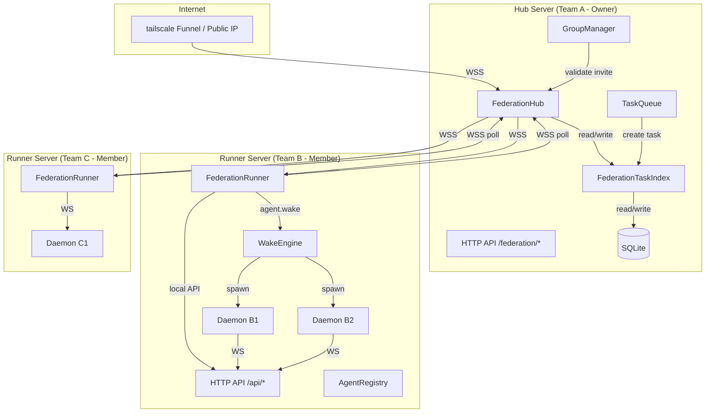

# System Architecture: Agent Chat Box — 联邦网关

**Date:** 2026-05-16
**Architect:** fjibj
**Version:** 1.0
**Project Type:** web-app
**Project Level:** 3
**Status:** Draft

---

## Document Overview

本文档定义 agent-chat-box 联邦网关的系统架构。在现有「群级扩展」架构之上，叠加联邦网络层，实现多团队群的松耦合连通。核心方案：联邦 Hub + Runner 星型拓扑——只有群 Hub 需要暴露公网，成员团队 Server 作为 Runner 反向连接，不需要公网 IP。

**Related Documents:**
- PRD: `docs/prd-federation-gateway-2026-05-16.md`
- Federation Analysis: `docs/federation-network-topology-analysis.md`
- Group Expansion Architecture: `docs/architecture-agent-chat-box-group-expansion-2026-05-11.md`

---

## Executive Summary

联邦网关是群级扩展的**网络基础设施层**，不是独立的业务系统。它在现有模块化单体架构中新增 `src/federation/` 目录，包含 Hub、Runner、Protocol 三个核心模块。联邦层完全独立于群的业务逻辑（契约、授权、信誉），通过 WebSocket 和 HTTP API 与现有模块交互。Daemon 和前端零改动。

---

## Architectural Drivers

1. **成员团队无公网 IP** → Runner 反向连接到 Hub，借鉴 GitHub Self-Hosted Runner
2. **松耦合、非中心化** → Hub 只协调不控制；Hub 故障时各团队内部功能不受影响
3. **协议统一** → 复用 slock.ai 的信封格式，前后端、Daemon、联邦网关共享同一解析器
4. **向后兼容** → 现有 API 和 WebSocket 协议不变，联邦是独立模块
5. **规模 50+ 团队** → Hub 只转发索引，不转发任务数据；poll 模式降低连接压力

---

## System Overview

### High-Level Architecture

```
                                    [Internet]
                                       |
                              [tailscale Funnel]
                                       |
                                [群 Hub Server]
                                (Owner Team A)
                                       |
                    ┌──────────────────┼──────────────────┐
                    |     WSS (反向连接)   |     WSS (反向连接)   |
                    ↓                  ↓                  ↓
              [Team B Server]    [Team C Server]    [Team D Server]
                 (Runner)           (Runner)          (Runner)
                    |                  |                  |
                 [Daemon]           [Daemon]           [Daemon]
```

**关键点：**
- Hub Server：群主团队托管，唯一需要暴露公网的节点
- Runner：成员团队的 Server，反向连接 Hub，不需要公网 IP
- Daemon：只连本团队 Server，完全不知道联邦存在
- 前端：通过本团队 Server 的联邦代理获取跨团队数据

### Architecture Diagram



### Architectural Pattern

**Pattern:** Hub-and-Spoke Federation — 星型联邦拓扑

**Rationale:**
- 只有 Hub 需要公网暴露，大幅降低成员团队的部署门槛
- Runner 反向连接解决 NAT 穿透，不需要端口映射
- Hub 只协调索引和授权，不控制任务执行，保持非中心化
- 协议层与业务层解耦，联邦层可独立演进

---

## Technology Stack

### Frontend

**Choice:** React + TypeScript + Tailwind CSS + shadcn/ui（保持不变）

**Rationale:** 前端零改动，所有联邦数据通过本地 Server 代理获取。

### Backend

**Choice:** Fastify + WebSocket (ws) + TypeScript（保持不变）

**Rationale:** 现有框架，新增 `src/federation/` 目录作为独立模块注册。

### Database

**Choice:** SQLite (sql.js)（保持不变）

**Rationale:** 新增 `federation_peers` 和 `federation_task_index` 表，通过迁移脚本 v8→v9 扩展。

### Network

**Choice:** WebSocket (WSS) + HTTP

**Rationale:**
- WSS 用于 Hub↔Runner 的持续连接（注册、心跳、消息推送）
- HTTP 用于 Runner 定期 poll 任务索引（借鉴 GitHub Runner poll 模式）
- tailscale Funnel 提供 HTTPS/WSS 终端，无需公网服务器

---

## System Components

### Component 1: FederationHub（联邦 Hub）

**Purpose:** 群主团队的 Server 作为 Hub，接收成员 Runner 的反向连接，协调群任务索引和消息路由。

**Responsibilities:**
- Runner 注册（验证 invite_code，建立 WSS 会话）
- 心跳检测（超时标记 disconnected）
- 消息路由（点对点 + 广播）
- 群任务索引管理（存入/查询/更新 `federation_task_index`）
- poll 端点（供 Runner 拉取可 claim 的任务列表）
- claim 路由（将 claim 请求转发到源团队 Server）

**Interfaces:**
- `WSS /federation` — Runner 注册与持续连接
- `GET /api/federation/poll` — Runner 拉取任务列表
- `POST /api/federation/claim` — Runner 代表 Agent claim 任务
- `POST /api/federation/heartbeat` — Runner 心跳

**Internal Methods:**
- `register(ws, registerMessage): boolean`
- `heartbeat(teamId): void`
- `broadcast(type, data, excludeTeam?): void`
- `sendTo(teamId, message): boolean`
- `disconnect(teamId, reason): void`

**Dependencies:** GroupManager（验证 invite_code）、TaskQueue（任务创建时同步到索引）

**FRs Addressed:** FR-F001, FR-F003, FR-F007

---

### Component 2: FederationRunner（联邦 Runner）

**Purpose:** 成员团队的 Server 作为 Runner，反向连接到群 Hub，代理本地的联邦操作。

**Responsibilities:**
- 反向连接 Hub（配置 federation_url + invite_code）
- 自动重连（指数退避）
- 定期心跳
- 定期 poll 群任务索引
- 接收 Hub 消息并分发到本地处理（task.broadcast、agent.wake 等）
- 将本地群任务发布/claim 请求转发到 Hub

**Interfaces:**
- `connect(): Promise<void>` — 建立 WSS 连接
- `startPolling(): void` — 启动 poll 循环
- `publishTask(task): Promise<void>` — 发布群任务到 Hub
- `claimTask(taskId, agentId): Promise<void>` — 向 Hub 发送 claim

**Dependencies:** WakeEngine（接收 wake 消息后调用本地引擎）、本地 HTTP API（任务操作）

**FRs Addressed:** FR-F001, FR-F003, FR-F005

---

### Component 3: FederationProtocol（联邦协议）

**Purpose:** 定义 Hub 和 Runner 之间的消息格式，复用 slock.ai 信封。

**Responsibilities:**
- 定义 `FederationMessage` 接口
- 定义消息类型枚举
- 消息序列化/反序列化
- 消息验证（schema check）

**Interfaces:**
```typescript
interface FederationMessage {
  v: number;
  id: string;
  type: FederationMessageType;
  ts: number;
  from: string;
  to?: string;
  data: unknown;
}

type FederationMessageType =
  | 'federation.register'
  | 'federation.heartbeat'
  | 'federation.member.joined'
  | 'federation.member.left'
  | 'federation.task.broadcast'
  | 'federation.task.claim'
  | 'federation.agent.wake';
```

**FRs Addressed:** FR-F004

---

### Component 4: FederationTaskIndex（联邦任务索引）

**Purpose:** Hub 端的群任务索引队列，供 Runner poll 拉取。

**Responsibilities:**
- 群任务发布后存入索引（状态 open）
- Runner poll 时按标签匹配过滤
- claim 后更新状态为 claimed
- 任务完成/过期后更新状态
- 退群后重置该团队已 claim 但未完成的任务

**Schema:**
```sql
CREATE TABLE IF NOT EXISTS federation_task_index (
  id TEXT PRIMARY KEY,
  task_id TEXT REFERENCES tasks(id) ON DELETE CASCADE,
  group_id TEXT REFERENCES groups(id) ON DELETE CASCADE,
  source_team_id TEXT REFERENCES teams(id),
  required_labels TEXT,
  status TEXT DEFAULT 'open' CHECK(status IN ('open','claimed','completed','expired')),
  claimed_by_team_id TEXT REFERENCES teams(id),
  claimed_at INTEGER,
  created_at INTEGER DEFAULT (unixepoch())
);
```

**FRs Addressed:** FR-F002, FR-F003

---

### Component 5: LabelMatcher（标签匹配器）

**Purpose:** 按标签子集匹配筛选可 claim 的 Agent。

**Responsibilities:**
- 解析 `required_labels` 和 `agent_labels`
- 子集匹配：`required_labels ⊆ agent_labels`
- 支持信誉分权重排序

**Algorithm:**
```typescript
function matchesLabels(required: string[], agentLabels: string[]): boolean {
  return required.every(r => agentLabels.includes(r));
}
```

**FRs Addressed:** FR-F002

---

## Data Architecture

### Data Model

新增实体：

```
FederationPeer (id, group_id, team_id, hub_url, status, labels, role_card, last_heartbeat, connected_at, disconnected_at)
  └── belongs to: Group, Team

FederationTaskIndex (id, task_id, group_id, source_team_id, required_labels, status, claimed_by_team_id, claimed_at, created_at)
  └── belongs to: Task, Group, Team

Agent (..., labels TEXT)  -- 扩展现有 agents 表
```

### Database Design

```sql
-- 联邦对等节点表
CREATE TABLE IF NOT EXISTS federation_peers (
  id TEXT PRIMARY KEY,
  group_id TEXT REFERENCES groups(id) ON DELETE CASCADE,
  team_id TEXT REFERENCES teams(id) ON DELETE CASCADE,
  hub_url TEXT NOT NULL,
  status TEXT DEFAULT 'connected' CHECK(status IN ('connected','disconnected','error')),
  labels TEXT,
  role_card TEXT,
  last_heartbeat INTEGER,
  connected_at INTEGER DEFAULT (unixepoch()),
  disconnected_at INTEGER,
  UNIQUE(group_id, team_id)
);

-- 联邦任务索引表
CREATE TABLE IF NOT EXISTS federation_task_index (
  id TEXT PRIMARY KEY,
  task_id TEXT REFERENCES tasks(id) ON DELETE CASCADE,
  group_id TEXT REFERENCES groups(id) ON DELETE CASCADE,
  source_team_id TEXT REFERENCES teams(id),
  required_labels TEXT,
  status TEXT DEFAULT 'open' CHECK(status IN ('open','claimed','completed','expired')),
  claimed_by_team_id TEXT REFERENCES teams(id),
  claimed_at INTEGER,
  created_at INTEGER DEFAULT (unixepoch())
);

-- 扩展现有 agents 表
ALTER TABLE agents ADD COLUMN labels TEXT DEFAULT '[]';

-- 索引
CREATE INDEX IF NOT EXISTS idx_federation_peers_group ON federation_peers(group_id);
CREATE INDEX IF NOT EXISTS idx_federation_peers_team ON federation_peers(team_id);
CREATE INDEX IF NOT EXISTS idx_federation_task_index_group ON federation_task_index(group_id, status);
CREATE INDEX IF NOT EXISTS idx_federation_task_index_labels ON federation_task_index(required_labels);
```

### Data Flow

#### 入群流程（Runner 注册）

```
1. Team A (Owner) 创建群 → 生成 invite_code + federation_url

2. Team B (Member) 配置 Server:
   FEDERATION_URL=wss://hub.team-a.ts.net/federation
   FEDERATION_INVITE_CODE=ABC123

3. Team B Server 启动 FederationRunner → connect():
   → WSS 连接到 Hub /federation
   → 发送 federation.register { invite_code, team_id, labels }

4. Hub FederationHub.register():
   → 验证 invite_code（未过期、未超次数）
   → 创建 federation_peers 记录
   → 回复注册成功
   → 广播 federation.member.joined 给所有在线成员

5. Team B Runner.startPolling():
   → 每 5~10 秒 GET /api/federation/poll
```

#### 跨团队任务发布 → Claim → 执行流程

```
1. Team A Owner → POST /api/groups/:gid/tasks
   → Server 创建 Task (is_group_task=1)
   → 同步创建 federation_task_index (status=open)

2. Hub 不主动广播。Team B Runner poll:
   → GET /api/federation/poll?team_id=B&labels=["python","review"]
   → Hub 按标签子集匹配返回任务列表

3. Team B Agent claim:
   → Runner 发送 federation.task.claim { task_id, agent_id }
   → Hub 路由到 Team A Server
   → Team A 创建 authorization_request (pending)

4. Team A Owner 批准:
   → POST /api/authorizations/:id/approve
   → Team A Server 通知 Hub: claim 已批准
   → Hub 发送 federation.agent.wake 给 Team B Runner

5. Team B Runner 接收 wake:
   → 调用本地 wakeEngine.wakeAgent(agent_id, 'federation.claim', context)
   → Daemon 唤醒 Agent 进程，携带任务上下文
   → Agent 开始执行

6. Agent 执行完成:
   → 更新 Task status = completed, output = 结果
   → 结果通过 Runner → Hub → Team A 回流
```

---

## API Design

### Hub Endpoints (Owner Team Server)

| Method | Path | Description |
|--------|------|-------------|
| WSS | `/federation` | Runner WebSocket 连接（注册、心跳、消息收发） |
| GET | `/api/federation/poll` | Runner 拉取可 claim 的任务列表 |
| POST | `/api/federation/claim` | Runner 代表 Agent claim 任务 |
| POST | `/api/federation/heartbeat` | Runner 心跳（也可通过 WSS） |

### Hub-to-Runner WSS Messages

```typescript
// 注册结果
{ type: 'federation.register.result', success: boolean, error?: string }

// 成员变更广播
{ type: 'federation.member.joined', team_id: string, team_name: string }
{ type: 'federation.member.left', team_id: string }

// 任务广播（可选，主要依赖 poll）
{ type: 'federation.task.broadcast', task_id: string, title: string, required_labels: string[] }

// Agent 唤醒
{ type: 'federation.agent.wake', agent_id: string, task_id: string, context: object }
```

### Runner-to-Hub WSS Messages

```typescript
// 注册
{ type: 'federation.register', invite_code: string, team_id: string, labels: string[] }

// 心跳
{ type: 'federation.heartbeat', team_id: string, timestamp: number }

// Claim
{ type: 'federation.task.claim', task_id: string, agent_id: string }

// 退群
{ type: 'federation.member.leave', team_id: string }
```

---

## Non-Functional Requirements Coverage

### NFR-F001: 网络延迟 < 100ms

**Solution:**
- WSS 长连接 + 心跳，避免重复握手
- poll 间隔 5~10 秒，同区域延迟 < 100ms
- 消息体精简（只传索引，不传任务数据）

**Validation:** 双节点本地测试，测量 WSS 往返延迟。

### NFR-F002: Hub 故障不影响成员内部功能

**Solution:**
- Hub 只协调不控制，不持有任务数据
- Runner 断线后，本地 Server 的 TaskQueue、AgentRegistry、MsgRouter 照常运行
- Runner 自动重连，恢复后自动同步错过的任务

**Validation:** 断开 Hub，验证 Team B 内部任务调度不受影响。

### NFR-F003: 安全

**Solution:**
- WSS 强制 TLS（tailscale Funnel 提供）
- invite_code 有过期时间和最大使用次数
- 消息签名验证（v2 扩展，当前版本预留字段）

**Validation:** 过期 invite_code 连接 → 拒绝。

### NFR-F004: 兼容性

**Solution:**
- Daemon 零改动：只连本团队 Server
- 前端零改动：通过本团队 Server 联邦代理
- 现有群 API 零改动：联邦层是独立模块

**Validation:** 不启用联邦配置，现有功能完全不变。

### NFR-F005: 可扩展性

**Solution:**
- Hub 只转发索引和授权请求，不转发任务数据
- 大文件走现有 upload API
- poll 模式避免 Hub 维护实时连接状态

**Validation:** 50 个 Runner 同时 poll，测量 Hub CPU/内存。

---

## Security Architecture

### Authentication

- Runner 通过 invite_code 注册到 Hub（一次性凭证）
- 注册成功后，Hub 通过 WSS 连接标识 Runner（无需额外 token）
- 心跳超时后需重新注册

### Authorization

- Runner 只能 claim 本团队有资格的任务（标签匹配）
- claim 后需源团队 Owner 授权，Runner 不能绕过
- Hub 不执行授权判定，只路由授权请求

### Data Isolation

- Hub 的 `federation_task_index` 只存任务元数据（id, title, labels），不存任务内容
- 任务内容（description, attachments）留在源团队 Server
- Agent 执行结果通过授权通道回流，Hub 不缓存

---

## Scalability & Performance

### Scaling Strategy

- **当前阶段：** 单 Hub + 50 Runner，SQLite 足够
- **未来扩展：** 大群拆分为子群，每个子群独立 Hub；Domain 层复用同一协议

### Performance Optimization

- `federation_task_index` 按 `(group_id, status)` 和 `(required_labels)` 建索引
- poll 查询使用 `LIMIT` 分页，避免全量加载
- Hub 内存中缓存 `team_id → ws` 映射，避免数据库查询连接

---

## Reliability & Availability

### High Availability

- Hub 单点故障 → 各团队内部仍可用，只是不能跨团队协作
- Runner 自动重连（指数退避 5s → 60s）
- Hub 恢复后，Runner 自动同步错过的任务（通过 poll）

### Disaster Recovery

- `federation_peers` 和 `federation_task_index` 是 SQLite 表，随数据库备份
- Hub 故障后重建：恢复数据库 + 重新暴露 federation_url，Runner 自动重连注册

---

## Integration Architecture

### Internal Integrations

```
FederationHub
  ├── GroupManager: 验证 invite_code
  ├── TaskQueue: 任务创建时同步到 federation_task_index
  ├── WakeEngine: claim 授权后发送 wake 消息
  └── WebSocket Handler: 注册 /federation WSS 路由

FederationRunner
  ├── WakeEngine: 接收 wake 后调用本地引擎
  ├── TaskQueue (local): 发布/claim 本地任务时同步到 Hub
  └── HTTP Client: poll Hub /api/federation/poll

FederationProtocol
  └── Shared types: 导出 FederationMessage 接口供前后端使用
```

### WebSocket Protocol Extension

新增消息类型：

```typescript
// 联邦消息（federation.* 前缀）
'federation.register'
'federation.register.result'
'federation.heartbeat'
'federation.member.joined'
'federation.member.left'
'federation.task.broadcast'
'federation.task.claim'
'federation.agent.wake'
```

---

## Development Architecture

### Code Organization

```
packages/server/src/
├── federation/
│   ├── protocol.ts      ← 新增：消息协议定义
│   ├── hub.ts           ← 新增：Hub 核心逻辑
│   ├── runner.ts        ← 新增：Runner 客户端
│   └── index.ts         ← 新增：模块导出
├── api/
│   └── agents.ts        ← 修改：支持 labels 字段
├── modules/
│   ├── task-queue.ts    ← 修改：任务创建时同步到联邦索引
│   └── wake-engine.ts   ← 修改：新增 federation.claim trigger
├── db/
│   ├── schema.sql       ← 修改：新增联邦表 + agents.labels
│   └── index.ts         ← 修改：迁移 v8→v9
├── ws/
│   └── handler.ts       ← 修改：注册 /federation 路由
└── index.ts             ← 修改：条件初始化 Runner

packages/shared/src/
└── types.ts             ← 修改：新增 FederationMessage 等类型
```

### Module Boundaries

- `federation/protocol.ts`: 纯类型定义，无依赖
- `federation/hub.ts`: 依赖 GroupManager、TaskQueue，不依赖 Runner
- `federation/runner.ts`: 依赖 WakeEngine、本地 API，不依赖 Hub 内部实现
- `federation/index.ts`: 模块门面，统一导出

### Testing Strategy

- 单元测试：LabelMatcher、Protocol 序列化/反序列化
- 集成测试：Hub + Runner 注册、心跳、消息收发
- E2E 测试：双 Server 实例完整流程（F010）

---

## Deployment Architecture

### Environments

- 开发环境：本地双 Server 实例（端口 3001 Hub, 3002 Runner）
- 生产环境：Owner 团队 Server 暴露 federation_url（tailscale Funnel）

### Deployment Configuration

**Hub Server (Owner):**
```bash
# 自动作为 Hub（群主团队）
# 无需额外配置，群创建时自动生成 federation_url
```

**Runner Server (Member):**
```bash
# 环境变量
export FEDERATION_URL=wss://hub.team-a.ts.net/federation
export FEDERATION_INVITE_CODE=ABC123
export FEDERATION_TEAM_ID=team-b
```

---

## Requirements Traceability

### Functional Requirements Coverage

| FR ID | FR Name | Components | Notes |
|-------|---------|------------|-------|
| FR-F001 | Runner 注册 | FederationHub, GroupManager | invite_code 验证 |
| FR-F002 | 标签匹配 | LabelMatcher, FederationTaskIndex | required_labels ⊆ agent_labels |
| FR-F003 | 队列拉取 | FederationHub, FederationRunner | poll 替代广播 |
| FR-F004 | 联邦消息协议 | FederationProtocol | slock 信封格式 |
| FR-F005 | Agent 跨团队唤醒 | FederationHub, FederationRunner, WakeEngine | federation.claim trigger |
| FR-F006 | 动态身份 | FederationPeer (role_card) | 热更新 |
| FR-F007 | 退群与断开 | FederationHub | member.left + 任务回池 |

### Non-Functional Requirements Coverage

| NFR ID | NFR Name | Solution | Validation |
|--------|----------|----------|------------|
| NFR-F001 | 延迟 < 100ms | WSS 长连接 + 精简消息体 | 本地双节点延迟测试 |
| NFR-F002 | Hub 故障容错 | Hub 只协调不控制 | 断 Hub 验证本地功能 |
| NFR-F003 | 安全 | WSS TLS + invite_code 过期 | 过期码连接 → 拒绝 |
| NFR-F004 | 兼容性 | Daemon/前端零改动 | 不启用联邦 → 行为不变 |
| NFR-F005 | 50+ 团队 | poll 模式 + 索引优化 | 50 Runner 压力测试 |

---

## Trade-offs & Decision Log

### Decision 1: Hub-and-Spoke vs Full Mesh

**Choice:** Hub-and-Spoke（星型）

**Trade-off:**
- ✓ 只有 Hub 需公网，成员部署门槛低
- ✓ 协议简单，Hub 只维护 N 个连接（N=成员数）
- ✗ Hub 单点故障时跨团队协作中断（但内部功能不受影响）

**Rationale:** Full Mesh 需要每个团队暴露公网，对个人/小团队不友好。Hub-and-Spoke 借鉴 GitHub Runner，实践证明可行。

### Decision 2: Poll vs Push

**Choice:** Poll（Runner 定期拉取）

**Trade-off:**
- ✓ Hub 不需要维护成员的实时连接状态
- ✓ 成员离线恢复后自动同步错过的任务
- ✗ 延迟增加（poll 间隔 5~10 秒）

**Rationale:** 群任务不是毫秒级敏感业务，5~10 秒延迟可接受。降低 Hub 复杂度更重要。

### Decision 3: WSS vs gRPC

**Choice:** WSS（WebSocket Secure）

**Trade-off:**
- ✓ 与现有 WebSocket 协议统一，共享解析器
- ✓ 浏览器/Node.js 原生支持，零依赖
- ✗ 二进制传输效率不如 gRPC

**Rationale:** 消息体小（JSON 文本），gRPC 的优势不明显。统一协议降低维护成本。

### Decision 4: 联邦层独立模块 vs 嵌入现有模块

**Choice:** 独立模块 `src/federation/`

**Trade-off:**
- ✓ 职责清晰，联邦层可独立演进
- ✓ 不启用联邦时，模块完全不加载
- ✗ 跨模块调用需要明确定义接口

**Rationale:** 联邦是可选功能，不是所有团队都需要。独立模块便于按需启用和后续扩展（Domain 层复用）。

---

## Open Issues & Risks

1. **Hub 单点故障**：Hub 挂了跨协作暂停。缓解：Hub 恢复后 Runner 自动重连；Domain 层可考虑多 Hub 热备（v2）。
2. **invite_code 传播安全**：邀请码通过什么渠道分享？缓解：建议通过加密聊天或邮件分享，邀请码有过期时间。
3. **WSS 连接稳定性**：弱网环境下 Runner 频繁重连。缓解：指数退避重连 + 心跳超时容忍。
4. **大群 poll 压力**：50+ Runner 同时 poll。缓解：poll 间隔随机抖动（5~10 秒均匀分布），数据库索引优化。

---

## Assumptions & Constraints

- 单 Hub 部署，不做多 Hub 热备（v1）
- SQLite 作为 Hub 数据库，不引入 PostgreSQL（v1）
- tailscale Funnel 提供 HTTPS/WSS 终端
- 初期 < 50 团队/群
- 联邦层完全可选，不启用时零开销

---

## Future Considerations

- **Hub 高可用**：多 Hub 实例 + 选举机制（v2）
- **消息签名**：Hub↔Runner 消息加签验证（v2）
- **Domain 层复用**：群 Hub 作为 Runner 连接到域 Hub，递归复用同一协议
- **带宽优化**：大文件传输走 P2P 或 CDN，Hub 只传索引

---

## Revision History

| Version | Date | Author | Changes |
|---------|------|--------|---------|
| 1.0 | 2026-05-16 | fjibj | Initial architecture for Federation Gateway |

---

## Next Steps

### Phase 4: Sprint Planning & Implementation

按架构蓝图实现：

1. **Sprint F-1（2 周）：协议 + Hub + Runner 基础设施**
   - F001: 协议定义
   - F002: 数据库迁移
   - F003: Agent labels + Role Card
   - F004: Hub Server 端点
   - F005: Runner 客户端

2. **Sprint F-2（2 周）：任务路由 + 唤醒 + E2E**
   - F006: 标签匹配
   - F007: Poll 拉取模式
   - F008: 跨团队唤醒
   - F009: 出入群广播
   - F010: E2E 全流程

---

**This document was created using BMAD Method v6 - Phase 3 (Solutioning)**

*To continue: Update `bmm-workflow-status.yaml` to mark `architecture-federation` as completed, then proceed to `sprint-planning-federation` and `dev-story-federation`.*
